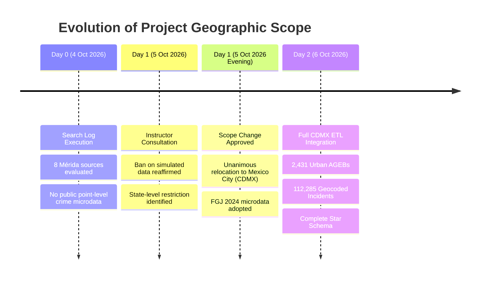

# 6. Limitations and Interpretation Cautions

*Author: Valeria Hernández*

Urban intelligence platforms that combine multi-source spatial microdata provide unprecedented visibility into intra-metropolitan dynamics. However, translating integrated data into sound diagnostic and policy conclusions requires rigorous awareness of structural limitations, administrative biases, and statistical constraints. This section details five fundamental limitations governing the interpretation of the Mexico City Urban Intelligence Data Warehouse.

---

## 6.1 Multi-Temporal Misalignment (*Temporal Mismatch*)

The analytical warehouse integrates three primary empirical sources collected under distinct temporal frames and update cadences:

| Domain | Source | Temporal Baseline | Grain & Nature |
|---|---|---|---|
| **Demographics** | INEGI Censo de Población y Vivienda | **March 2020** | Decennial decennial census snapshot |
| **Public Safety** | FGJ CDMX Carpetas de Investigación | **Full Year 2024** | Continuous criminal investigation records |
| **Economic Units** | INEGI DENUE (CDMX) | **October 2025 – 2026** | Semi-annual registry snapshot |

### Methodological Implications
1. **Denominator Lag in Rate Computations:** Demographic indicators derived from `fact_census_ageb` reflect pre-pandemic residential baselines (March 2020). Calculating 2024 crime rates per 100,000 residents or business-to-population ratios assumes demographic stability over a 4-year interval. However, Mexico City experienced significant post-pandemic demographic restructuring between 2020 and 2024, including intra-urban migration, real-estate gentrification in central corridors (e.g., Cuauhtémoc, Benito Juárez, Miguel Hidalgo), and suburban expansion in peripheral alcaldías.
2. **Resident Population vs. Ambient/Floating Population:** The census records night-time resident populations (*de jure* enumeration). In major commercial, financial, and tourist employment hubs (e.g., Centro Histórico, Paseo de la Reforma, Polanco, Santa Fe), the daily ambient population inflates by hundreds of thousands of commuters, workers, and consumers. As a consequence, computing per-capita crime rates using static resident denominators artificially inflates rates in central commercial districts and understates rates in purely residential commuter neighbourhoods.
3. **Analytical Caution:** Ratios such as `crime_rate_per_100k` should be interpreted strictly as relative territorial exposure indicators, not as individual victimisation probabilities for local residents.

---

## 6.2 The "Dark Figure" of Crime (*Cifra Negra*) and Administrative Reporting Bias

The data stored in `fact_crime_incident` represents official **investigation files (*carpetas de investigación*)** initiated by the Fiscalía General de Justicia de la Ciudad de México (FGJ CDMX). It does not represent the exhaustive reality of criminal occurrences across the territory.

### Critical Distortion Mechanisms
1. **Elevated Underreporting (*Cifra Negra*):** According to INEGI's National Survey on Victimization and Public Safety Perception (*ENVIPE 2024*), the *cifra negra* in Mexico City stands at **92.6 %**: approximately 9 out of 10 crimes committed are never reported to the authorities or do not result in a formal investigation folder. 
2. **Differential Reporting Propensity across Crime Typologies:** Reporting probability is heavily influenced by external incentives. Offences requiring an official complaint to claim insurance compensation—such as *Robo de Vehículo Particular* or *Robo de Motocicleta*—exhibit relatively high reporting rates (~55–65 %). Conversely, non-violent street robbery, extortion (*cobro de piso*), minor fraud, domestic violence, and sexual offences suffer from severe institutional underreporting due to fear of reprisal, bureaucratic friction, or lack of trust in justice institutions.
3. **Geographic Reporting Inequity:** Proximity to Territorial Investigation Agencies (*Agencias del Ministerio Público*) and specialized fiscalías increases formal reporting rates. Central, well-serviced urban cores exhibit higher reporting density partly due to institutional accessibility, whereas isolated peripheral communities (e.g., southern rural fringes of Tlalpan, Xochimilco, or Milpa Alta) face physical and administrative barriers to filing complaints.
4. **Procedural vs. Occurrence Timing (`fecha_inicio` vs. `fecha_hecho`):** As established in our exploratory profiling (`notebooks/13_profile_crime.ipynb`), the FGJ dataset is organised by the date the investigation was initiated (`fecha_inicio`). Over **11.18 %** (15,503 records) of the carpetas opened in 2024 pertained to offences committed in previous years (spanning 2014–2023). Our transformation pipeline strictly isolated offences occurring in 2024 (`CRIME_YEAR = 2024`) to preserve temporal validity.

---

## 6.3 Census Data Suppression and Statistical Confidentiality

To safeguard individual privacy and prevent statistical re-identification, INEGI applies strict confidentiality protocols under the *Ley del Sistema Nacional de Información Estadística y Geográfica (LSNIEG)* at fine geographic aggregations (urban blocks and AGEBs):

1. **Suppression Masks (`*` and `N/D`):** In low-density blocks or AGEBs where an indicator count falls below statistical disclosure thresholds, INEGI masks numeric values with asterisks (`*`) or non-disclosed tags (`N/D`). In our ETL pipeline, these values are preserved as SQL `NULL` values rather than being coerced to `0`, preventing distorted mathematical aggregations. The warehouse explicitly registers data suppression exposure via the `n_suppressed_fields` KPI in `fact_census_ageb`.
2. **Extreme Rates in Low-Population Units (`low_population = True`):** Across the 2,431 urban AGEBs in Mexico City, **55 AGEBs contain fewer than 100 residents**, and **17 AGEBs have a resident population of zero** (e.g., airport runways, industrial clusters, Chapultepec Park, Ciudad Universitaria campus). 
   - Dividing incident counts or establishment totals by resident populations in these units causes mathematical singularities (division by zero) or wildly inflated per-capita rates.
   - The dimensional model marks these units with the `low_population` boolean flag in `v_kpi_ageb`. All bivariate, regression, and spatial autocorrelation models must systematically exclude `low_population = True` records from rate-based statistics.

---

## 6.4 Modifiable Areal Unit Problem (MAUP) & Ecological Fallacy

Spatial analysis conducted on aggregated polygonal boundaries is structurally susceptible to two classical geographic phenomena:

### 1. The Modifiable Areal Unit Problem (MAUP)
* **Scale Effect:** Aggregating point microdata (DENUE establishments and FGJ crime incidents) into urban AGEB polygons smooths local spatial point processes. While AGEBs are the most granular operational units publishing socioeconomic census data, they vary substantially in territorial extent across Mexico City—from compact, hyper-dense parcels in Cuauhtémoc (~0.05 km²) to extensive, irregular polygons along the conservation borders of Tlalpan and Xochimilco (>5.0 km²).
* **Zoning Effect:** Administrative AGEB boundaries are historical cartographic constructs designed for census logistics, not functional boundaries of human mobility, criminal markets, or economic interaction. A crime occurring on an avenue separating two AGEBs is arbitrarily assigned to one polygon, even though its causal dynamics involve both sides of the roadway.

### 2. The Ecological Fallacy
* High spatial correlation between commercial density (DENUE SCIAN 46) and property crime in an urban AGEB does **not** imply that local shopkeepers or specific business patrons are perpetrators of criminal acts.
* Statistical associations identified in spatial models (e.g., Global and Bivariate Moran's I) evaluate environmental and situational opportunity structures (e.g., foot traffic, commercial attractors, transit nodes), and must never be interpreted as individual-level causal determinants.

---

## 6.5 Geographic Scope Reorientation: From Mérida to Mexico City

The foundational project design was initially targeted at the municipality of **Mérida, Yucatán (cvegeo 31050)**. However, rigorous data profiling during Phase 1 revealed insurmountable open-data constraints:

### Search Log Audit & Decision Rationale
1. **Exhaustive Evaluation of Mérida Repositories:** As documented in `notebooks/13_profile_crime.ipynb` (§1.1), eight official sources were queried on 4 October 2026:
   * *SESNSP Open Data:* Provided only monthly, municipal-level totals without geographic coordinates.
   * *FGE Yucatán:* Provided press bulletins and judicial procedural overviews without tabular or spatial microdata.
   * *Yucatán Transparency Portal & Mérida Geoportal:* Contained transport, health, and urban infrastructure layers, but zero public-safety or incident layers.
   * *CEISP Data Observatory:* Archived 104 monthly PDF reports; server endpoints consistently returned `null` for download attempts.
   * *Academic Repositories (UADY, CentroGeo, Zenodo, Kaggle):* No public point-level crime microdata existed.
2. **Academic & Ethical Constraint:** On 5 October 2026, course leadership explicitly ruled out synthetic or simulated datasets:
   > *"No simulated data. If you have municipal-level data, your spatial analysis must stay at state level. For high granularity you can consider hoyodecrimen.com, but working with Mexico City."*
3. **Methodological Resolution:** To maintain spatial analysis at the intra-urban microdata level (point-to-polygon spatial joins and neighbourhood spatial weights) without compromising research ethics, the team unanimously pivoted to **Mexico City (state `09`, 16 alcaldías, 2,431 urban AGEBs)**.
4. **Impact on Results:** While the dimensional architecture, pipeline design, and data contracts remained preserved, the empirical reality shifted from a medium-sized provincial metropolis to one of the largest polycentric megacities in the hemisphere, characterized by complex radial-concentric crime patterns, substantial socio-spatial segregation, and intense daytime commuting flows.

---

## 6.6 Summary Checklist for Analysts & Decision-Makers

To prevent analytical misinterpretations, all subsequent analytical notebooks (Phase 3) and executive reporting chapters must adhere to the following protocol:

- [x] **Always filter out `low_population = True`** when computing or visualizing per-capita crime or economic rates.
- [x] **Distinguish between resident rates and ambient risk:** Acknowledge that high crime rates in commercial or transit corridors reflect foot-traffic exposure rather than resident culpability.
- [x] **Treat crime counts as reported investigation files,** explicitly noting the ~92.6 % *cifra negra* in policy narratives.
- [x] **Preserve SQL `NULL` semantics** for suppressed census attributes (`n_suppressed_fields > 0`).
- [x] **Refrain from drawing causal claims** from bivariate spatial associations (Moran's I reflects spatial co-occurrence, not direct causation).
